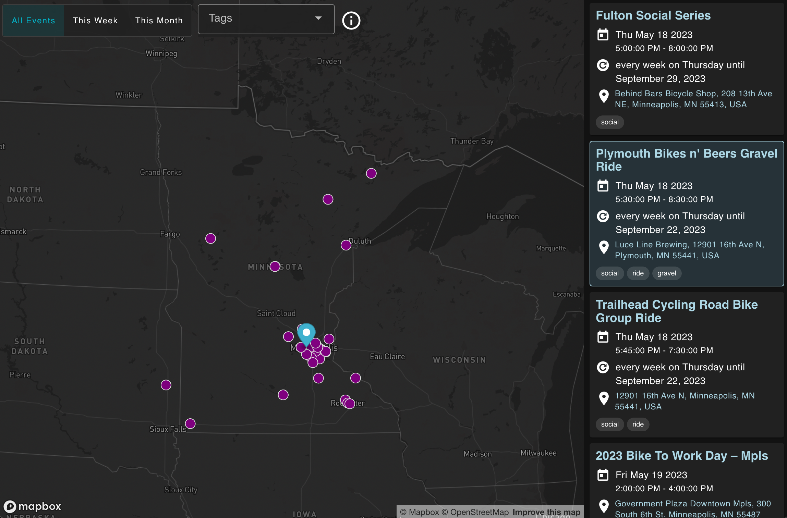

# BikeGroups.org



This is the fully open source repository for BikeGroups.org.

You can read more about this project on the about page: https://subdavis.notion.site/About-BikeGroups-org-f04b4012659c495c8e7a539395e23b13

## About the software

It is a fully static application, meaning there is no backend server.  The database is a public google calendar, which is compiled into JSON data by scheduled github action.

## Running data compilation

This repository is designed to work with a google calendar.  You can subscribe to it directly if you want to use it without the website.

```
5b0f9ebb2f4cca6705cf48ad4e4562964a7e3f90d6f2646e11c19788912c86ba@group.calendar.google.com
```

You'll need google account credentials for the `Calendar` and `Geocoding` APIs. Setting this up is complicated, google it.

```bash
# copy env example and fill it with google account credentials
cp .env.example .env

# run calendar data processing
yarn process-calendar
```

## Running the application

Without data, you probably can't do this yet.  I'm working on it.

```bash
# install stuff
yarn

# run the server
yarn dev
```

## Recommended IDE Setup

- [VS Code](https://code.visualstudio.com/) + [Volar](https://marketplace.visualstudio.com/items?itemName=Vue.volar) (and disable Vetur) + [TypeScript Vue Plugin (Volar)](https://marketplace.visualstudio.com/items?itemName=Vue.vscode-typescript-vue-plugin).

